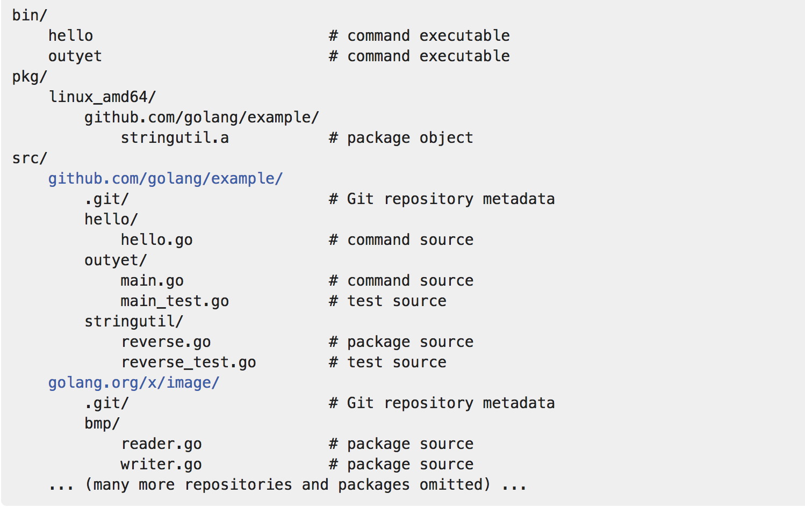

[toc]
##### 如何写一个go
go代码只保存在一个工作空间
一个工作空间包含许多版本控制库
每一个库包含一个或多个包
每个包由一个或多个go源代码仅在一个文件夹下
每个包的文件夹的路径决定了它的import路径

不同于其他语言，其他语言在每一个项目内只有一个独立的工作空间，工作空间也紧密的绑定这版本控制库
- GOPATH
  - go help gopath
  - go env
  - go env GOPATH
  - [详情](https://golang.org/cmd/go/#hdr-GOPATH_environment_variable)
- 工作空间组成
  - 
  - src通常包含多个版本控制库，用于跟踪一个或多个源文件包的开发

- import 路径
  1. 一个导入路径是唯一指定一个包的字符串，一个包的引入路径和它的位置包含工作空间或一个远程仓库相关联
  2. 标准库提供一些简短的导入路径如"fmt","net/http"
  3. 对于自己的包，必须选择一个不可能和未来增加到标准库或其他外部包冲突的基本路径
  4. 如果保存代码到一个源码库，你应该选择源码库的根路径作为基本路径
  5. 像某天要发布代码一样组织代码结构是一个良好的习惯
 ``` shell
   比如使用github.com/user作为基本路径，创建文件夹包含你的工作空间来保存源代码
   mkdiir -p $GOPATH/src/github.com/user
 ```

- 用go编译和安装项目
  1. 你可以在本地的任何位置执行命令 如 go install github.com/usr/hello，go tool在GOPATH指定的工作空间下根据包名github.com/usr/hello寻找源代码
  2. 在github.com/usr/hello文件夹下，可以只执行go install命令
  3. 这个命令编译构建hello命令，生成一个可执行的binary，它会把这个文件安装到工作空间的bin文件夹下
  4. 当有错误时，go工具才打印结果，因此没有输出，认为是执行成功
  5. go build 编译文件


- libary
  1. 例子stringutil，go install 会在pkg文件夹下生成包对象
  2. 生成的stringutil.a对象会在pkg/linux_amd64下，**映射**对应的源文件
  3. linux_amd64 为了交叉编译，反应系统的操作系统和系统架构


- package names
  1. 源代码的第一行必须是package *name*, 这个name 默认指定引入时的名字，如例子reverse.go
  2. go约定package的名字是import路径的最后一个元素，如crypto/rot13包被imported，那么包名字就叫做rot13
  3. 可执行的命令必须使用package main
  4. 没有要求所有链接到一个二进制文件的包的名称都是唯一的，仅仅是import路径(文件全名)必须唯一
  5. [go的命名约定](https://golang.org/doc/effective_go.html#names)

- Testing
  - go有一个轻量级的测试框架，由go test命令和testing包组成
  - 写一个以_test.go结尾的文件，内容包含命名为TestXXX带有(t *testing.T)签名的函数
  - 测试框架运行每一个这样的函数，如果函数调用一个错误的函数，比如t.Error或t.Fail,这个测试被为失败了
  - go help test 命令和[查看更多详情](https://golang.org/pkg/testing/)

- Remote packages
  - import 路径可以描述怎么用版本控制器获取包的源代码，go 工具使用这个特性自动从远程获取包
  - 如果在import路径包含了远程仓库的地址，go get将自动获取、编译、安装它
  - 如go get github.com/golang/example/hello
  - import路径相同，go get命令
  - 这个约定让你的go包以最简单的方式提供给其他人
  - [godoc.org](https://godoc.org/)和[gowiki](https://github.com/golang/go/wiki/Projects)提供了外部的go包
  - [更多详细信息](https://golang.org/cmd/go/#hdr-Remote_import_paths)
