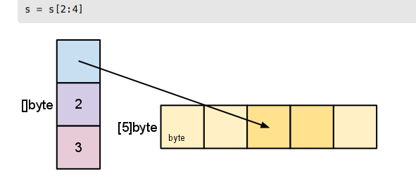
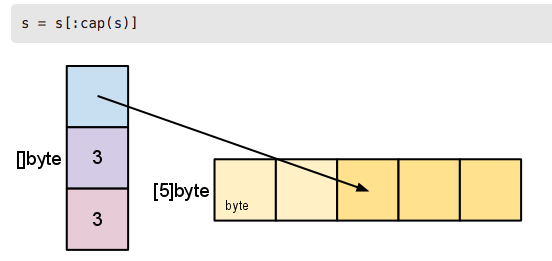

[toc]
#### basics
##### Pointers
- go有指针，一个指针存放值内存地址的位置
- *T 是一个指向T的指针，他的zero value 是nil
```go
var p *int
```
- & 操作符给他的操作数生成指针
```go
i:=42
p=&i
```
- * 操作符标书指针的基础值
```go
fmt.Println(*p)
*p=21
```
- go里面没有指针的计算
- 指针里的`*` 要放在类型的前面，而不是变量的前面
- 下面例子j的值
```go
func main() {
	i, j := 42, 2701
	p := &i         // point to i
	fmt.Println(*p) // read i through the pointer
	*p = 21         // set i through the pointer
	fmt.Println(i)  // see the new value of i

	p = &j         // point to j
	*p = *p / 37   // divide j through the pointer
	fmt.Println(j) // see the new value of j
}
```
##### Structs
- 一个struct是一个字段的集合
```go
type Vertex struct {
    X int
    Y int
}
func main() {
	fmt.Println(Vertex{1, 2})
}
```
- struct的字段可用点号访问
```go
v:=Vertex{1,2}
v.X=4
```
###### Pointers to structs
- struct 值域可以通过一个指向struct的指针访问
- var p *Vertex
- (*p).X
- 然而这种标注是比较笨重的，因此go允许直接写为p.x,不用显示的解引用
- > \*是解引用符号，\&是引用符号，**解引用指变量指向所引用对象的本身数值**

###### Struct Literals
- 一个struct literal表示一个分配的struct值
- 属性值命名的顺序无关紧要
- \&前缀返回一个指向struct值的指针
- 用：指定成员值

```go
var (
	v1 = Vertex{1, 2}  // has type Vertex
	v2 = Vertex{X: 1}  // Y:0 is implicit
    v2 = Vertex{X: 1,Y:1} //
	v3 = Vertex{}      // X:0 and Y:0
	p  = &Vertex{1, 2} // has type *Vertex
)

func main() {
	fmt.Println(v1, p, v2, v3)
}

```
##### Array
- [n]T表示n个T类型的值组成的数组
- 数组长度是数据类型的一部分，因此不能被重新指定
- 指针数组形式 var ptr [3]*int;
- 不指定长度的数组 b := [...]string{"Penn", "Teller"}

```go
 var a [10]int
 var a [2]string
 a[0]="Hello"
 a[1]="world"
 fmt.Println(a) // 结果 [Hello world]
 primes :=[6]int{2,3,5}
```
##### Slices
- slice 是一个动态指定长度，一个数组内元素的可变视图
- 实际上，slice比array更常用
- 切片也可以通过“切片”现有的**切片或数组**来形成。
- 一个slice指定两个参数，一个地范围，一个高范围，之间用冒号分割
- a[low:high]
- 这个范围是个半开放的，包含第一个元素，但是不包含最后一个
- a[1:4] 这个创建一个slice，它包含3个元素
- slice 不存放任何数据，它只是一个数组一部分的描述
- 改变slice的元素，会修改关联的数组的元素，数组共用的其他分片(slice)也修改
```go
a := names[0:2]
b := names[1:3]
fmt.Println(a, b)

b[0] = "XXX"
fmt.Println(a, b)
fmt.Println(names)
```
- slice包含指向数组的指针，元素的长度，它的容量(元素的最大长度)

###### Slice literals
- 一个slice字面量像是一个没有长度的数组字面量
- [3]bool{true, true, false} 这个是数组的字面量
- []bool{true, true, false} 这是slice的字面量,它会创建和上面一样的数组，然后构建一个slice指向它
```go
// 结构数组
s := []struct {
		i int
		b bool
	}{{2, true},
		{3, false},
		{5, true},
		{7, true},
		{11, false},
		{13, true},
	}
	fmt.Println(s)
```
###### Slice defaults
- 当使用slice时，可以省略高或者底的边界，使用默认值
- 低边界默认是0，高边界默认是slice的长度值，0便是第一个元素
- 对于数组var a[10]int,下面的表达式都是相等的
```go
a[0:10]
a[:10]
a[0:]
a[:]
```
- **注意**下面的表达式的值，可以看出slice可以是另一个slice的视图，不一定是数组，即重新分片
```go
s := []int{2, 3, 5, 7, 11, 13}
s = s[1:4]
fmt.Println(s) // [3 5 7]

s = s[:2] //[3 5]
fmt.Println(s)
```
###### Slice length and capacity
- slice 同时具有一个长度和一个容量
- 长度就是slice包含元素的个数
- 容量是它依赖的底层数组的元素数量，从slice里从第一个元素开始计数的个数
- 通过len(s)和cap(s)可以获取长度和容量

```go
func main() {
	s := []int{2, 3, 5, 7, 11, 13}
	printSlice(s)
	// Slice the slice to give it zero length.
	s = s[:0]
	printSlice(s)
	// Extend its length.
	s = s[:4]
	printSlice(s)
	// Drop its first two values.
	s = s[2:]
	printSlice(s)
}
func printSlice(s []int) {
	fmt.Printf("len=%d cap=%d %v\n", len(s), cap(s), s)
}
```
- **如果切片具有*足够的容量*，可以通过重新切片来延长切片的长度**
- 看下面神奇的结果
``` go
	s = s[:4]
	printSlice(s)  // len=4 cap=6 [2 3 5 7]
	s = s[:5]
	printSlice(s) //len=5 cap=6 [2 3 5 7 11]
	// Drop its first two values.
	s = s[2:]
	printSlice(s) //len=3 cap=4 [5 7 11]
```
- 理解：
  - 长度和容量的区别
  - s=s[2:4]
   
  - s=s[:cap(s)]
   
- 总结以上几个例子，发现一旦低范围参数指定了，那么slice的容量就会减少，指定高范围的参数并不影响容量，只影响长度
###### Nil slices
- slice的zero value是nil
- nil slice 的长度和容量是0，没有底层数组
```go
var s []int
fmt.Println(s, len(s), cap(s))
```
###### Creating a slice with make
- 用make函数创建Slice，也就是如何创建动态长度的数组
- 分配一个调到零位的数组 ，返回一个指向这个数组的slice
- 传递make函数的第三个函数，可以指定容量
 ```go
   a := make([]int, 5)  // len(a)=5
   b := make([]int, 0, 5) // len(b)=0, cap(b)=5
   b = b[:cap(b)] // len(b)=5, cap(b)=5
   b = b[1:]      // len(b)=4, cap(b)=4
 ```
- Slice可以包含任何类型，包括其他slice
```go
// Create a tic-tac-toe board.
	board := [][]string{
		[]string{"_", "_", "_"},
		[]string{"_", "_", "_"},
		[]string{"_", "_", "_"},
	}

	// The players take turns.
	board[0][0] = "X"
	board[2][2] = "O"
	board[1][2] = "X"
	board[1][0] = "O"
	board[0][2] = "X"

	for i := 0; i < len(board); i++ {
		fmt.Printf("%s\n", strings.Join(board[i], " "))
	}
```
###### Appending to a slice
- go 提供append函数来添加元素到slice
- [api-doc](https://golang.org/pkg/builtin/#append)
- append 函数会追加元素到slice的末尾，如果它有充足的空间，仅仅就分配空间给新元素，如果不是，一个新的基础数组会被分配，append返回更新的slice
- **特殊的用例**：append一个字符串到一个字节类型的slice里，是合法的
```go
slice = append([]byte("hello "), "world"...)
```
- 如果底层数组太小不能满足所有给定的值，那么会分配一个更大的数组
- 返回的slice将指向新的分配数组
- 介绍Slice，[Go Slices: usage and internals](https://blog.golang.org/go-slices-usage-and-internals)
###### slice 扩容
- 创建一个更大的slice，拷贝内容到元素的slice中
```go
t := make([]byte, len(s), (cap(s)+1)*2) // +1 in case cap(s) == 0
for i := range s {
        t[i] = s[i]
}
s = t
```
- copy函数支持不同长度的slice之间的拷贝,它返回**拷贝元素的个数**
``` go
t := make([]byte, len(s), (cap(s)+1)*2)
copy(t, s)
s = t
```
- copy可以处理共享相同底层数组的源和目标片，正确地处理重叠的片。
- append

###### 一个可能的问题点
- 重新切片一个片并不会生成底层数组的副本。完整的数组将保存在内存中，直到不再引用它。有时，当只需要一小部分数据时，这会导致程序将所有数据保存在内存中。
- 例如，下面的代码,返回的slice指向包含所有文件的数组，由于这个slice指向原始数组，只要这个slice还在，垃圾回收器就不能回收这个数组，文件中几个有用的字节将整个内容保存在内存中。
```go
var digitRegexp = regexp.MustCompile("[0-9]+")

func FindDigits(filename string) []byte {
    b, _ := ioutil.ReadFile(filename)
    return digitRegexp.Find(b)
}
```
- 优化
```go
func CopyDigits(filename string)[]byte {
    b, _ := ioutil.ReadFile(filename)
    b = digitRegexp.Find(b)
    c := make([]byte, len(b))
    copy(c, b)
    return c
}
```
